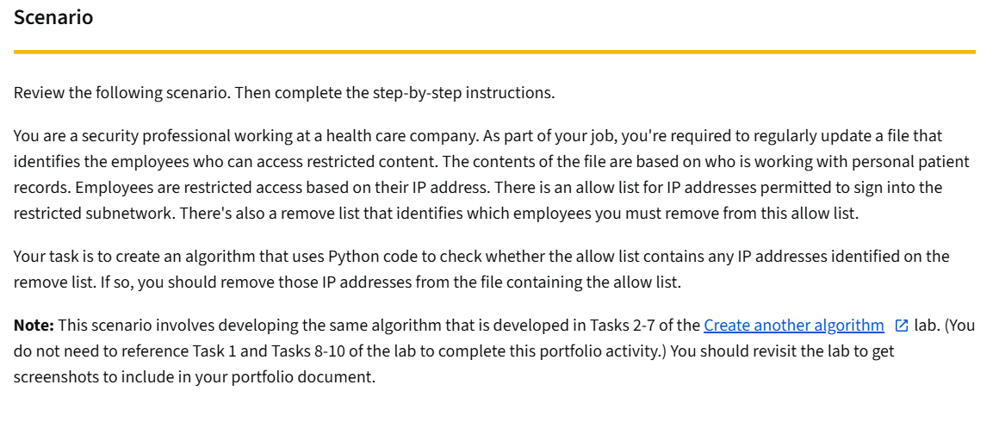
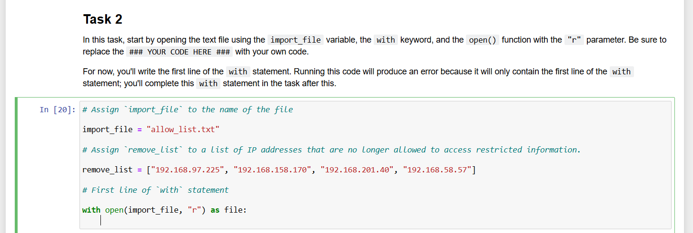

# Algorithm for File Updates in Python

## Project Description
This project demonstrates a Python algorithm for maintaining an allow list of approved IP addresses in a healthcare environment. The workflow reads a text file of authorized IP addresses, compares those entries against a separate `remove_list`, and deletes any addresses that should no longer have access to restricted content.

Core skills demonstrated:
- File handling with context managers (`with open(...)`)
- String-to-list and list-to-string conversion
- Iteration and conditional logic
- Writing updated records back to a file

## Screenshots
- [Scenario prompt](python_scenario.png)
- [Starting code](python_scenario_starting_code.png)





## 1. Open the Allow List File
```python
import_file = "allow_list.txt"

with open(import_file, "r") as file:
```

The variable `import_file` stores the target file name. The file is opened in read mode (`"r"`) using a context manager. Using `with` ensures the file closes automatically after the block executes.

## 2. Read File Contents
```python
    ip_addresses = file.read()
```

The `.read()` method loads the full file content into memory as one string.

## 3. Convert the String to a List
```python
ip_addresses = ip_addresses.split()
```

The `.split()` method separates the string into individual IP address elements using whitespace or line breaks. Converting to a list allows targeted removals.

## 4. Iterate Through the Remove List
```python
for element in remove_list:
```

This loop checks each IP address in `remove_list` one at a time.

## 5. Remove Matching IP Addresses
```python
    if element in ip_addresses:
        ip_addresses.remove(element)
```

For each `element`, the condition verifies whether it exists in `ip_addresses`. If it exists, `.remove()` deletes it from the allow list.

## 6. Write the Updated Allow List Back to the File
```python
ip_addresses = "\n".join(ip_addresses)

with open(import_file, "w") as file:
    file.write(ip_addresses)
```

The updated list is reassembled into a newline-separated string and written back to `allow_list.txt` in write mode (`"w"`).

## Summary
This algorithm opens the allow list file, reads it into Python, and converts the data from a string into a list. It then compares each item in `remove_list` against approved IP addresses and removes any matches. Finally, it writes the revised allow list back to the same file.

From a cybersecurity operations perspective, this demonstrates practical access-control maintenance using Python automation and file parsing.
