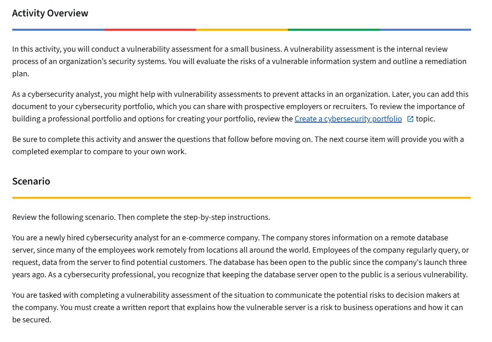

# Vulnerability Assessment – NIST SP 800-30 (Entry-Level Report)

## Project Overview
This project documents a basic vulnerability assessment using the risk assessment concepts from **NIST SP 800-30 Rev. 1**. The goal is to identify likely vulnerabilities, describe potential threats and impacts, and recommend practical mitigations a small business could implement.

This writeup is structured to show clear security thinking and documentation skills at an entry-level.

---

## Scenario
A scenario image/worksheet is provided with the activity.

Scenario image:
- `vulnerability_assessment_scenario.png`

Completed activity report (PDF):
- `Vulnerability assessment report.pdf`

Preview:

## Evidence / Artifacts
- Scenario image: [vulnerability_assessment_scenario.png](vulnerability_assessment_scenario.png)
- Completed report PDF: [Vulnerability assessment report.pdf](Vulnerability%20assessment%20report.pdf)

---

## Scope
This assessment focuses on:
- The system(s) and account(s) described in the scenario
- Likely vulnerabilities that could be exploited
- Business impact if exploitation occurs
- Recommended mitigations and follow-up actions

Out of scope:
- Penetration testing or exploitation
- Full enterprise risk program development

---

## Method (How I Approached It)
I followed a simplified version of the NIST SP 800-30 risk assessment flow:
1. **Identify assets and purpose** (what needs protection and why)
2. **Identify threat sources and events** (who/what could cause harm)
3. **Identify vulnerabilities and predisposing conditions** (what could be exploited)
4. **Identify likelihood and impact** (how probable and how damaging)
5. **Determine risk** (combine likelihood + impact)
6. **Recommend controls** (how to reduce likelihood and/or impact)

---

## Assets (What I’m Protecting)
Based on the scenario, the key assets include:
- Customer/employee data (PII)
- Business systems (workstations, servers, cloud apps)
- Accounts and credentials (admin, finance, HR)
- Critical business processes (payments, payroll, invoicing)

---

## Threats (Who/What Could Cause Harm)
Common threat sources that apply to this type of scenario:
- External attacker (phishing, credential theft)
- Insider threat (intentional misuse)
- Former employee/contractor (access not removed)
- Malware / ransomware
- Accidental misuse (misconfiguration, unsafe sharing)

---

## Vulnerabilities Identified
This section lists the main vulnerabilities observed in the scenario and supporting documentation.

1. **Access not removed after role change/termination**
   - Risk: unauthorized access using old accounts

2. **Overly broad permissions / no least privilege**
   - Risk: one account can make high-impact changes (payments, payroll, bank info)

3. **Weak authentication controls** (example: no MFA on sensitive accounts)
   - Risk: credential theft leads to account takeover

4. **Limited monitoring/alerting for high-risk events**
   - Risk: malicious activity is not detected quickly

---

## Risk Analysis (Likelihood, Impact, and Overall Risk)
Because this is a training activity, I used a simple qualitative scale.

| Risk Item | Likelihood | Impact | Overall Risk | Notes |
|---|---|---|---|---|
| Unauthorized access via active terminated account | High | High | High | Preventable with offboarding + access reviews |
| Privilege misuse due to broad admin access | Medium | High | High | Needs RBAC + approval steps |
| Account takeover (no MFA) | Medium | High | High | MFA reduces likelihood significantly |
| Delayed detection due to weak logging/alerts | Medium | Medium | Medium | Monitoring improves response time |

---

## Recommendations (Mitigations)
These are practical actions that reduce the likelihood of recurrence.

### Access control improvements
- Implement **RBAC** and enforce **least privilege**
- Remove admin rights from users who do not need them
- Require **dual approval** for sensitive changes (payments, payroll, new bank details)

### Account lifecycle controls
- Create a mandatory **offboarding process** (HR + IT) with same-day account disablement
- Run a **weekly/monthly access review** to validate employment status and permissions

### Authentication
- Enforce **MFA** for all admin and finance-related accounts
- Block legacy authentication if applicable

### Monitoring and logging
- Alert on:
  - logins from unusual locations/IPs
  - privileged actions (payroll changes, new payees)
  - any activity from disabled/terminated accounts
- Ensure logs are retained long enough for investigations

---

## What I Did (Activity Log)
- Reviewed the scenario prompt and supporting documentation
- Identified likely assets, threats, and vulnerabilities
- Estimated likelihood and impact using a qualitative scale
- Documented risks and recommended mitigations focused on access control

---

## Files in This Folder
- Main report: `nist-800-30-vulnerability-assessment.md`
- Scenario image(s): `vulnerability_assessment_scenario.png`
- Supporting docs (PDF/worksheet/reference): `Vulnerability assessment report.pdf` and any additional examples

---

## Portfolio Note
This project demonstrates structured documentation, basic vulnerability assessment thinking, and control recommendations aligned to NIST risk assessment concepts.
